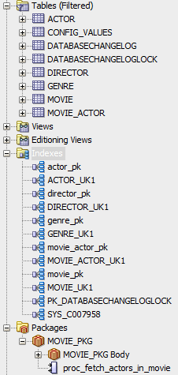
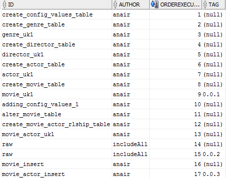

Database refactoring using Liquibase
==========
This project demonstrates database refactoring using Liquibase maven commands against Oracle 11g database.

Reference
----

* [Liquibase Reference](http://www.liquibase.org/documentation/)    
* [Liquibase Maven reference](http://www.liquibase.org/documentation/maven/)
* [Evolutionary Database Design](http://martinfowler.com/articles/evodb.html)         

Prerequisites
--------
1. JDK 6+
2. Maven 3+
3. Git     
4. Oracle 11g database          

Versions used
-----
- Liquibase maven plugin: 3.3.1         
	- Liquibase core: 3.3.0                
- Oracle client: 11.2.0.1.0       

Database setup
---------
1. Create a tablespace or reuse something you have. This example will use tablespace as "MOVIE_TBLSPACE"         
2. Create a schema and name it anything. In this project we'll assume the schema name as "MOVIE"     
3. Create a user "MOVIE_APP_USER" that will have select, update, insert, delete table access         
4. Create a user "MOVIE_RO" that will have select table access           

     	       
Maven commands and inputs
-----------
[Maven command reference](http://www.liquibase.org/documentation/maven/)  

This project expects the following values to be passed in as JVM args:     
    
* DB_URL - Database url       
* DB_USERNAME - Database username   
* DB_PASSWORD - Database password      
* DB_SCHEMA - Database schema    
* DB_CONTEXT - Choose which environment specific data needs to run. If black, all scripts will run   
* LOG_LEVEL(Optional) - Keep it at INFO. Change if required         

To generate dbDoc and print update sqls and rollback sql:                  
	
	mvn -DLOG_LEVEL=INFO -DDB_CONTEXT=local -DDB_USERNAME=MOVIE -DDB_PASSWORD=MOVIE -DDB_SCHEMA=MOVIE -DDB_URL=jdbc:oracle:thin:@localhost:1521:xe liquibase:updateSQL liquibase:dbDoc

To execute changesets:         
	
	mvn -DLOG_LEVEL=INFO -DDB_CONTEXT=local -DDB_USERNAME=MOVIE -DDB_PASSWORD=MOVIE -DDB_SCHEMA=MOVIE -DDB_URL=jdbc:oracle:thin:@localhost:1521:xe liquibase:update

To tag a database based on the project pom version:        
	
	mvn -DLOG_LEVEL=INFO -DDB_CONTEXT=local -DDB_USERNAME=MOVIE -DDB_PASSWORD=MOVIE -DDB_SCHEMA=MOVIE -DDB_URL=jdbc:oracle:thin:@localhost:1521:xe liquibase:tag

To rollback sqls till a tag version:                
	
	mvn -DLOG_LEVEL=INFO -DDB_CONTEXT=local -DDB_USERNAME=MOVIE -DDB_PASSWORD=MOVIE -DDB_SCHEMA=MOVIE -DDB_URL=jdbc:oracle:thin:@localhost:1521:xe liquibase:futureRollbackSQL -Dliquibase.rollbackTag=0.0.2    
       

Database refactor Lifecycle
---------       
### Database Tag version 0.0.1
* [000-changelog.xml](src/main/resources/000/000-changelog.xml) that creates the base database          
	- Create tables: Actor, Genre, Director, Movie, config_values 
	              
### Database Tag version 0.0.2
* [001-changelog.xml](src/main/resources/001/001-changelog.xml)  
	- Insert into config_values table      
	- Alter movie table    
	- Create movie_actor relationship table    
	- Insert records into actor, genre, director tables
	- Create a stored procedure package and body    
	     
### Database Tag version 0.0.3
* [002-changelog.xml](src/main/resources/002/002-changelog.xml)     
	- Insert into config_values table         
	- Insert into movie, movie_actor tables     
	     

